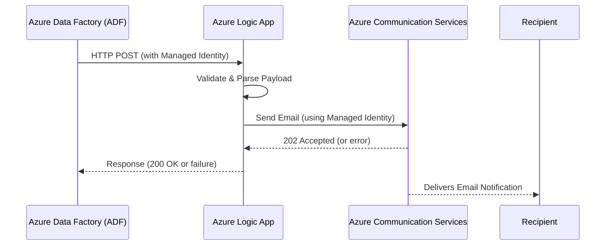

# Azure Logic App - ADF Email Notification via Azure Communication Services

This Logic App is designed to handle **ADF pipeline status notifications** (both success and failure) and send emails through **Azure Communication Services (ACS)** with built-in **retry and exponential backoff** logic.

---

## ✅ Use Case

This Logic App acts as a common notification endpoint for ADF pipelines across multiple applications in the organization. It formats and sends a customized HTML email using minimal input data and is built to be extended for other channels (Teams, logging, etc.)

---

## 📬 How It Works

1. **Trigger**: HTTP `POST` with JSON payload
2. **Authorization**: Checks for `Bearer` token in `Authorization` header
3. **Extract** input fields and generate:
   - Email **subject**
   - Email **HTML body**
4. **Retry Loop**:
   - Send email through **ACS Email API**
   - If `statusCode == 202`, consider it success
   - Retry with exponential backoff if failed
5. **Terminate** with success message when email is sent or retries exhausted

---

## 📦 Payload Specification

The Logic App expects a JSON payload via HTTP POST. Below is the required structure:

### 🔹 Required Fields (Mandatory)

| Field                | Type     | Description                                |
|----------------------|----------|--------------------------------------------|
| `severity`           | string   | `high` = failed, `info` = completed        |
| `version`            | string   | Fixed version tag, e.g., `"1.0a"`          |
| `resource_group`     | string   | ADF resource group                         |
| `app_name`           | string   | App/system name, e.g., `ccwp`              |
| `service_name`       | string   | ADF name (Data Factory name)              |
| `pipeline_name`      | string   | ADF pipeline name                          |
| `execution_date_time`| string   | Format `dd/MM/yyyy HH:mm:ss`              |
| `message`            | string   | Message to include in email                |

### 🔸 Optional Fields

| Field               | Type       | Description                                |
|---------------------|------------|--------------------------------------------|
| `batch_date`        | string     | Format `dd/MM/yyyy`                         |
| `error_code`        | string     | Only relevant if `severity = high`         |

---

## 📧 Email Template Overview

- **Subject**:  
  `ADF Fail : APP_NAME/RG/SCB/PIPELINE_NAME  **<datetime>**`  
  _(or `ADF Completed : ...` if severity is info)_

- **Body (HTML)**:
  Includes:
  - App name, RG, Service name
  - Pipeline
  - Execution time
  - Message (and error code if failure)

---

## 🧪 Example Payloads

### ✅ ADF Completed Example

```json
{
  "severity": "info",
  "version": "1.0a",
  "resource_group": "rg-adf-prod",
  "app_name": "ccwp",
  "execution_date_time": "05/04/2025 07:30:00",
  "pipeline_name": "CopyDataToBlob",
  "service_name": "adf-ccwp-pipeline",
  "message": "Data pipeline completed successfully"
}
```

---

### ❌ ADF Fail Example

```json
{
  "severity": "high",
  "version": "1.0a",
  "resource_group": "rg-adf-prod",
  "app_name": "ccwp",
  "execution_date_time": "05/04/2025 07:30:00",
  "pipeline_name": "CopyDataToBlob",
  "service_name": "adf-ccwp-pipeline",
  "error_code": "DF-5001",
  "message": "Error copying data to Blob Storage"
}
```

---

## 🔄 Retry Mechanism

- Maximum **3 retry attempts**
- Uses **exponential backoff** (5s, 10s, 20s...)
- Stop when:
  - `statusCode == 202` (email accepted)
  - Or retries exhausted

---

## 🛠️ Extending This Workflow

You can easily extend this Logic App to:
- Send notification to **Microsoft Teams**
- Push data to **Azure Monitor / Log Analytics**
- Log status to external services or databases
- Add more conditions for dynamic routing

---

## 🔐 Authorization

The Logic App expects a `Bearer` token in the request header:

```http
Authorization: Bearer <your_token>
```

> You can enforce token validation via Azure API Management or Function Proxy as a security gateway.

---

## 📣 Contact

For further enhancement, maintenance, or integration into additional environments (UAT/Prod), please contact your platform/DevOps team or solution architect.

---

## 🔗 Reference: Using Managed Identity from ADF to Logic App

This solution leverages the secure practice of calling the Logic App from ADF using **Managed Identity** through a Web Activity.

### 🔄 ADF → Logic App via Web Activity (Managed Identity)

- Use **Web Activity** in ADF to trigger the Logic App endpoint.
- In the Web Activity settings:
  - Select `Authentication` = `Managed Identity`
  - Use `System Assigned Managed Identity` from ADF
  - Add the Logic App's **"Managed Identity Caller"** role for the ADF identity

📚 **Official guide:**
👉 [Use Azure Data Factory to invoke Logic App via Managed Identity](https://techcommunity.microsoft.com/blog/integrationsonazureblog/use-azure-data-factory-to-invoke-logic-app-via-managed-identity-authentication/3804218)

> This ensures that all communication is secured via Azure AD without the need for secrets or hardcoded tokens.

---

## 📊 Integration Flow (Mermaid Diagram)



This sequence diagram shows how ADF communicates securely with Logic App and forwards alert notifications through Azure Communication Services.
