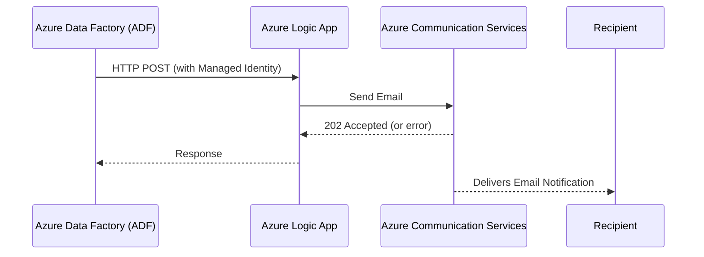
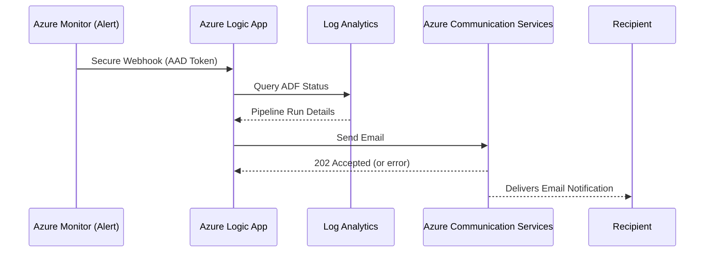

# Azure Logic App - ADF Email Notification via Azure Communication Services

This Logic App is designed to handle **ADF pipeline status notifications** (both success and failure) and send emails through **Azure Communication Services (ACS)** with built-in **retry and exponential backoff** logic.

---

## ✅ Use Case

This Logic App acts as a common notification endpoint for ADF pipelines across multiple applications in the organization. It supports **two patterns** of notification input:

### 🔹 Pattern 1: Custom ADF Web Activity
ADF calls this Logic App via HTTP `POST` Web Activity with a defined payload schema. Authentication is handled via **Managed Identity** of ADF.

### 🔸 Pattern 2: Azure Monitor Alert (Common Schema)
Azure Monitor Metric Alerts (e.g., for ADF failures/success) trigger this Logic App using a **secure webhook** (with AAD auth). The Logic App queries **Log Analytics** to enrich the alert before sending the email.

---

## 📬 How It Works

### Pattern 1 - Web Activity Trigger (Custom Payload)

1. ADF pipeline calls this Logic App via HTTP POST with predefined payload
2. Logic App:
   - Parses the JSON payload
   - Composes HTML Email body + subject
   - Sends email via **ACS Email API**
   - Retries with exponential backoff if failed
3. Logic App terminates after success or maximum retries

### Pattern 2 - Azure Monitor Common Alert Trigger

1. Azure Monitor fires **Metric Alert** → triggers this Logic App via **Secure Webhook**
2. Logic App:
   - Authorizes via AAD using **audience: api://<APP_ID>**
   - Parses Common Alert Schema
   - Queries Log Analytics for detailed ADF pipeline run
   - Composes and sends formatted HTML email via **ACS**
   - Retries on failure

---

## 📦 Payload Specifications

### Pattern 1 - Custom Payload

See: [`alert_custom.json`](./alert_custom.json)

#### Required Fields

| Field                | Type     | Description                                |
|----------------------|----------|--------------------------------------------|
| `severity`           | string   | `high` = failed, `info` = completed        |
| `version`            | string   | Fixed version tag, e.g., `"1.0a"`          |
| `resource_group`     | string   | ADF resource group                         |
| `app_name`           | string   | App/system name, e.g., `ccwp`              |
| `service_name`       | string   | ADF name (Data Factory name)              |
| `pipeline_name`      | string   | ADF pipeline name                          |
| `execution_date_time`| string   | Format `dd/MM/yyyy HH:mm:ss`              |
| `message`            | string   | Message to include in email                |

#### Optional Fields

| Field               | Type       | Description                                |
|---------------------|------------|--------------------------------------------|
| `batch_date`        | string     | Format `dd/MM/yyyy`                         |
| `error_code`        | string     | Only relevant if `severity = high`         |

---

### Pattern 2 - Azure Monitor Alert (Common Schema)

See: [`alert_azure_monitor.json`](./alert_azure_monitor.json)

- The Logic App expects **Common Alert Schema** payload via secure webhook
- Enriches data from Log Analytics via Managed Identity query

---

## 📧 Email Template Overview

- **Subject**:  
  `ADF Fail : APP_NAME/RG/SCB/PIPELINE_NAME  **<datetime>**`  
  _(or `ADF Completed : ...` if severity is info)_

- **Body (HTML)**:
  Includes:
  - App name, RG, Service name
  - Pipeline
  - Execution time
  - Message (and error code if failure)

---

## 🔄 Retry Mechanism

- Maximum **3 retry attempts**
- Uses **exponential backoff** (5s, 10s, 20s...)
- Stop when:
  - `statusCode == 202` (email accepted)
  - Or retries exhausted

---

## 🛠️ Extending This Workflow

You can easily extend this Logic App to:
- Send notification to **Microsoft Teams**
- Push data to **Azure Monitor / Log Analytics**
- Log status to external services or databases
- Add more conditions for dynamic routing

---

## 🔐 Authorization

### Pattern 1 - Custom ADF Call

- Uses **System Assigned Managed Identity** of ADF
- Logic App requires "Managed Identity Caller" role assignment

```http
Authorization: Managed Identity (automatically handled by ADF)
```

### Pattern 2 - Azure Monitor Alert (Secure Webhook)

- Azure Monitor Action Group (Azns AAD Webhook) calls Logic App with **AAD token**
- Logic App trigger uses `Authorize with AAD` policy
- Required:
  - `audience`: `api://<app-id>` from Logic App App Registration (Expose API)
  - `Object ID`: from Azure Monitor Action Group Identity

---

## 🔗 ADF to Logic App Setup

📚 [Using ADF Web Activity with Managed Identity](https://techcommunity.microsoft.com/blog/integrationsonazureblog/use-azure-data-factory-to-invoke-logic-app-via-managed-identity-authentication/3804218)

---

## 📊 Integration Flow (Pattern 1 - Web Activity)



---

## 📊 Integration Flow (Pattern 2 - Azure Monitor)



---

## ⚠️ Configuration Before Use

Ensure the following:

- ⚙️ `senderAddress` in ACS is verified
- ✅ Azure Monitor Alert uses **Secure Webhook**
- 🛡️ Audience is set to `api://<app-id>` of Logic App App Registration
- 👤 Object ID from Action Group Identity is added to Logic App Authorization Policy

---

## 📎 File Samples

- [`alert_custom.json`](./alert_custom.json) – Payload format from ADF Web Activity (Pattern 1)
- [`alert_azure_monitor.json`](./alert_azure_monitor.json) – Common Alert Schema from Azure Monitor (Pattern 2)

---

## 📣 Contact

For enhancements, deployment help, or platform alignment:
> Contact your platform/DevOps team or cloud solution architect.
---

## 🧾 Notes When Using the Example Files (`alert_custom.json` / `alert_azure_monitor.json`)

When using these sample alert payloads in your environment, make sure you:

1. 🔐 **Configure your verified sender properly**:
    ```json
    "senderAddress": "DoNotReply@preedee.space"
    ```
    Replace `DoNotReply@preedee.space` with your **verified sender email address** registered in **Azure Communication Services (ACS)**.

2. 🧑‍💼 **Specify actual recipient addresses**:
    ```json
    "recipients": {
        "to": [
            {
                "address": "XXX",
                "displayName": "XXX"
            }
        ]
    }
    ```
    Replace `XXX` with **valid email addresses** that you want to send the notification to.

3. 📧 **Keep placeholders dynamic**:
    Ensure that:
    - `@outputs('Set_Subject')` refers to your dynamic subject
    - `@outputs('Set_Body')` is the dynamic HTML body content generated inside the Logic App workflow.

> ⚠️ Azure Communication Services will **reject** email requests using **unverified sender addresses** or malformed payloads.