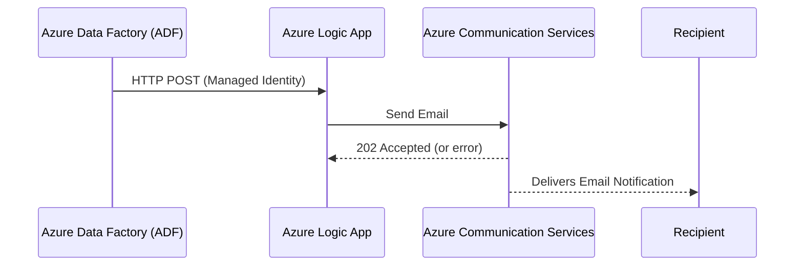
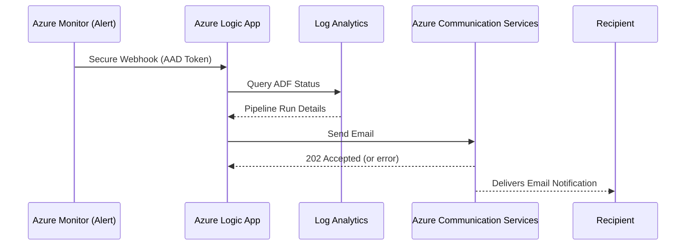
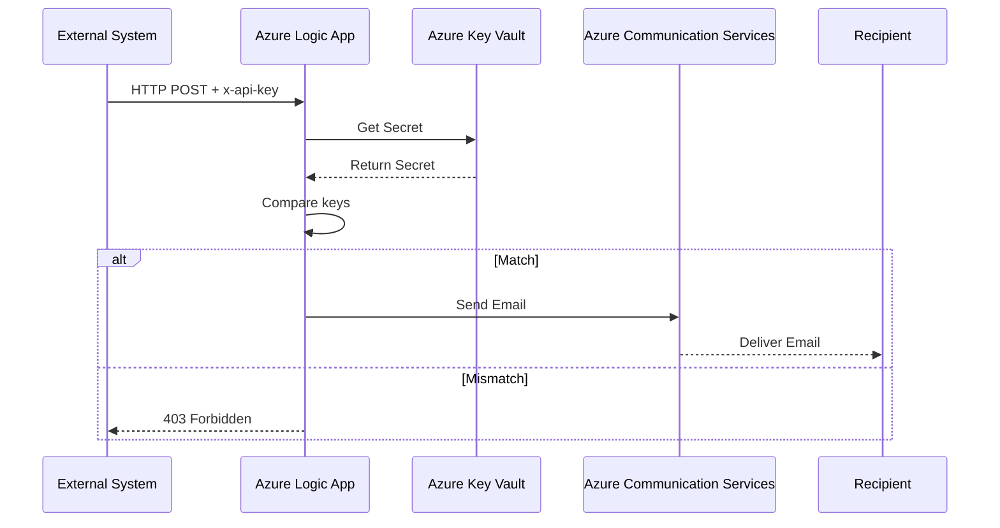

# Azure Logic App - ADF Email Notification via Azure Communication Services

This Logic App handles **ADF pipeline status notifications** (success and failure) and sends emails via **Azure Communication Services (ACS)** with retry logic.

---

## ✅ Use Case

Supports three patterns of notification:

### 🔹 Pattern 1: ADF Web Activity (Managed Identity)
ADF uses HTTP POST to Logic App. Auth via Managed Identity.

### 🔸 Pattern 2: Azure Monitor Alert (Common Schema)
Triggered by Metric Alert using **Secure Webhook** (AAD token). Enriches data via **Log Analytics** query.

📘 [Common Alert Schema Docs](https://learn.microsoft.com/en-us/azure/azure-monitor/alerts/alerts-common-schema)

#### Example KQL Query

```kusto
let statusToCheck = "Failed";
let ADFActivity = ADFActivityRun | where Status == statusToCheck;
let ADFPipeline = ADFPipelineRun
| where Status == statusToCheck
| extend FactoryName = extract(@"FACTORIES/([^/]+)", 1, tostring(ResourceId))
| project PipelineRunId = RunId, PipelineName, PipelineStart = Start, PipelineEnd = End, FactoryName, PipelineStatus = Status;
ADFActivity
| join kind=inner (ADFPipeline) on PipelineRunId
| project FactoryName, PipelineRunId, PipelineName, PipelineStatus, PipelineStart, PipelineEnd, ActivityRunStart = Start, ActivityRunEnd = End, Error
| summarize TotalActivities = count(), FirstActivityStart = min(ActivityRunStart), LastActivityEnd = max(ActivityRunEnd), ErrorMessages = make_list(Error, 100) by FactoryName, PipelineRunId, PipelineName, PipelineStatus, PipelineStart, PipelineEnd
| extend ConcatenatedErrors = strcat_array(ErrorMessages, "\n")
```

### 🔹 Pattern 3: Splunk-Compatible ADF Event
Integrates with external systems like Splunk using either:
- `x-api-key` header compared to secret in Key Vault
- or **Managed Identity** authentication (for secure internal use)

#### Example Files:
- `alert_custom_splunk_payload.json` – Auth via API Key
- `alert_custom_splunk_payload_msi.json` – Auth via Managed Identity

---

## 📊 Pattern Diagrams

### Pattern 1


### Pattern 2


### Pattern 3


---

## 📦 Payload Specifications

### Pattern 1 & 3

```json
{
  "event": {
    "subject": "ADF Success",
    "env": "dev",
    "severity": "high",
    "version": "1.0",
    "resource_group": "RG-SEA-HRO-SIT-001",
    "app_name": "sit-hro-ied",
    "batch_date": "01/05/2025",
    "execution_date_time": "01/05/2025 12:35:00",
    "service_name": "scbhroseaadf001sit",
    "pipeline_name": "sit-hro-ied",
    "message": "Process Job1 Success"
  }
}
```

### Example cURL (Pattern 3 - API Key)

```bash
curl -v -X POST "https://<your_logic_app_url>" \
  -H "Content-Type: application/json" \
  -H "x-api-key: 123456789" \
  -d '{
    "event": {
      "subject": "ADF Success",
      "env": "dev",
      "severity": "high",
      "version": "1.0",
      "resource_group": "RG-SEA-HRO-SIT-001",
      "app_name": "sit-hro-ied",
      "batch_date": "01/05/2025",
      "execution_date_time": "01/05/2025 12:35:00",
      "service_name": "scbhroseaadf001sit",
      "pipeline_name": "sit-hro-ied",
      "message": "Process Job1 Success"
    }
  }'
```

---

## 🔐 Authorization

### Pattern 1
- Auth: **Managed Identity**
- Ensure ADF has role access to Logic App endpoint.

### Pattern 2
- Auth: **AAD Token** from Action Group Secure Webhook
- Audience: `api://<logic-app-app-id>`

### Pattern 3
- Option 1: **x-api-key** header – Logic App compares with Key Vault secret
- Option 2: **Managed Identity** – Uses system-assigned identity for secured internal calls

**Note**: If using API Key, **Azure Key Vault must allow public access** (required for Logic App Consumption Plan)

---

## 🔗 Setup Guide
📚 [Use ADF to Call Logic App with Managed Identity](https://techcommunity.microsoft.com/blog/integrationsonazureblog/use-azure-data-factory-to-invoke-logic-app-via-managed-identity-authentication/3804218)

---

## 🧾 Notes When Using Sample Files

1. Replace `senderAddress` with verified sender from ACS.
2. Replace recipient email in the payload.
3. Use `@outputs('Set_Subject')` and `@outputs('Set_Body')` in Logic App.

---

## 📣 Contact

For questions about any pattern, please open an issue or discussion in this repository.
