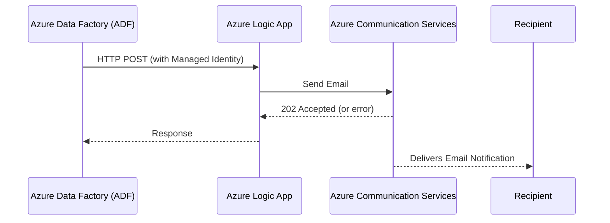
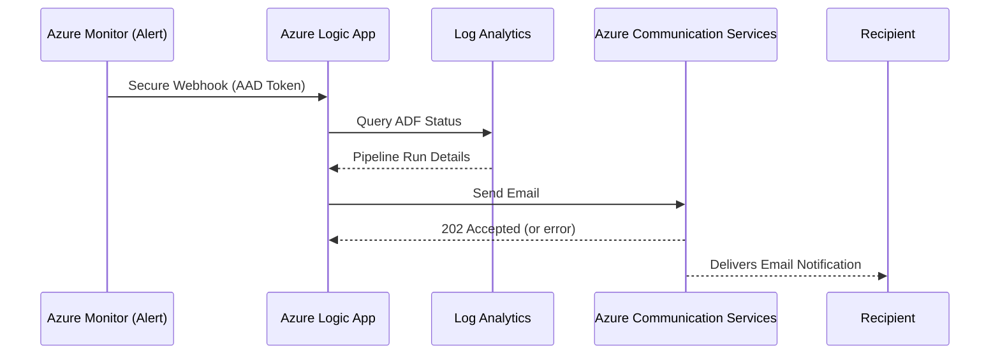
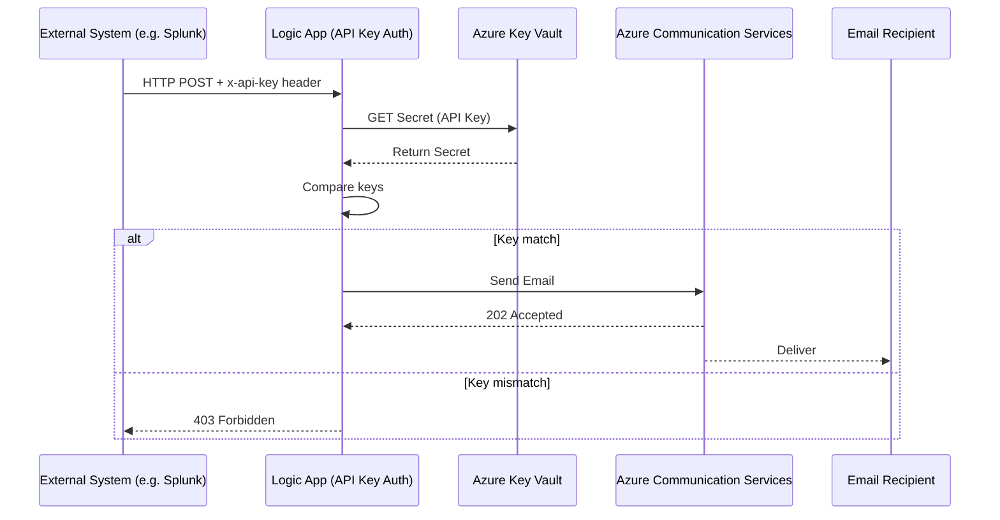

# Azure Logic App - ADF Email Notification via Azure Communication Services

This Logic App is designed to handle **ADF pipeline status notifications** (both success and failure) and send emails through **Azure Communication Services (ACS)** with built-in **retry and exponential backoff** logic.

---

## ✅ Use Case

This Logic App acts as a common notification endpoint for ADF pipelines across multiple applications in the organization. It supports **three patterns** of notification input:

### 🔹 Pattern 1: Custom ADF Web Activity (Managed Identity Auth)
ADF calls this Logic App via HTTP `POST` Web Activity with a defined payload schema. Authentication is handled via **Managed Identity** of ADF.

### 🔸 Pattern 2: Azure Monitor Alert (Common Schema)
Azure Monitor Metric Alerts (e.g., for ADF failures/success) trigger this Logic App using a **secure webhook** (with AAD auth). The Logic App queries **Log Analytics** to enrich the alert before sending the email.

👉 See Azure Common Alert Schema documentation: [Common Alert Schema Format (Microsoft Docs)](https://learn.microsoft.com/en-us/azure/azure-monitor/alerts/alerts-common-schema)

### 🔹 Pattern 3: Splunk-Compatible ADF Event with API Key Auth
This new pattern allows integration with systems like Splunk via simple event-based HTTP POST. It uses **API Key authentication** passed in HTTP headers. Logic App validates the `x-api-key` against a secret stored in **Azure Key Vault**.

---

## 📬 How It Works

### Pattern 1 - Web Activity Trigger (Custom Payload with Managed Identity)


### Pattern 2 - Azure Monitor Alert Trigger


### Pattern 3 - API Event via API Key Auth (e.g., Splunk)


---

## 📦 Payload Specifications

### Pattern 1 - Custom Payload (ADF Web Activity)
See: `alert_custom.json`

### Pattern 3 - Splunk-Compatible Payload with API Key
See: `alert_custom_splunk_payload.json`

#### Example cURL Request:
```bash
curl -v -X POST "https://prod-20.southeastasia.logic.azure.com:443/workflows/f57fdda1f66c4d94b4130d5259f0f689/triggers/When_a_HTTP_request_is_received/paths/invoke?api-version=2016-10-01&sp=%2Ftriggers%2FWhen_a_HTTP_request_is_received%2Frun&sv=1.0"   -H "Content-Type: application/json"   -H "x-api-key: 123456789"   -d '{
    "event": {
        "subject": "ADF Success",
        "env": "dev",
        "severity": "high",
        "version": "1.0",
        "resource_group": "RG-SEA-HRO-SIT-001",
        "app_name": "sit-hro-ied",
        "batch_date": "01/05/2025",
        "execution_date_time": "01/05/2025 12:35:00",
        "service_name": "scbhroseaadf001sit",
        "pipeline_name": "sit-hro-ied",
        "message": "Process Job1 Success"
    }
}'
```

---

## 🔗 ADF to Logic App Setup
📚 [Using ADF Web Activity with Managed Identity](https://techcommunity.microsoft.com/blog/integrationsonazureblog/use-azure-data-factory-to-invoke-logic-app-via-managed-identity-authentication/3804218)

---

## 📣 Contact
If you have any questions regarding the usage of each pattern, please reach out via the Contact section in this GitHub repository.

---

## 🧾 Notes When Using the Example Files (`alert_custom.json` / `alert_azure_monitor.json`)

When using these sample alert payloads in your environment, make sure you:

1. 🔐 **Configure your verified sender properly**:
    ```json
    "senderAddress": "DoNotReply@preedee.space"
    ```
    Replace `DoNotReply@preedee.space` with your **verified sender email address** registered in **Azure Communication Services (ACS)**.

2. 🧑‍💼 **Specify actual recipient addresses**:
    ```json
    "recipients": {
        "to": [
            {
                "address": "XXX",
                "displayName": "XXX"
            }
        ]
    }
    ```
    Replace `XXX` with **valid email addresses** that you want to send the notification to.

3. 📧 **Keep placeholders dynamic**:
    Ensure that:
    - `@outputs('Set_Subject')` refers to your dynamic subject
    - `@outputs('Set_Body')` is the dynamic HTML body content generated inside the Logic App workflow.

> ⚠️ Azure Communication Services will **reject** email requests using **unverified sender addresses** or malformed payloads.